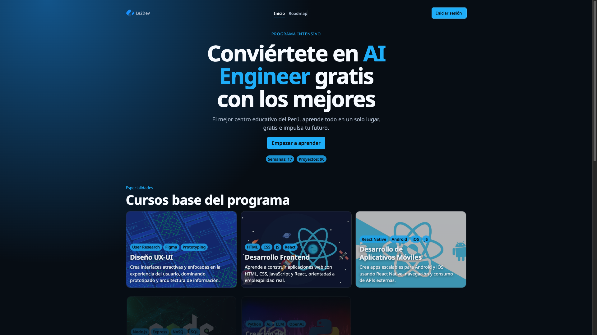

# Le2Dev

Plataforma educativa de **Desarrollo Frontend** con experiencia editorial, roadmap por semanas y catálogo de proyectos prácticos.



## Quick Start
```bash
npm install
npm run dev
```

## Scripts
- `npm run dev` → entorno local
- `npm run build` → build de producción
- `npm run preview` → preview del build
- `npm run lint` → revisión con ESLint
- `npm run content:manifest` → regenera el catálogo de contenido

## Rutas Principales
- `/` → Home
- `/desarrollo-frontend` → semanas del roadmap
- `/desarrollo-frontend/:weekSlug` → proyectos de una semana

## Contenido
El contenido didáctico está en:
- `public/content/desarrollo-frontend`

El manifiesto se genera automáticamente con:
- `scripts/generate-content-manifest.mjs`

Salida generada:
- `src/data/contentManifest.ts`

> No editar `contentManifest.ts` manualmente.


## Stack
- React
- TypeScript
- Vite
- React Router
- CSS modular

---

Made with ❤️ by Elliot Garamendi
